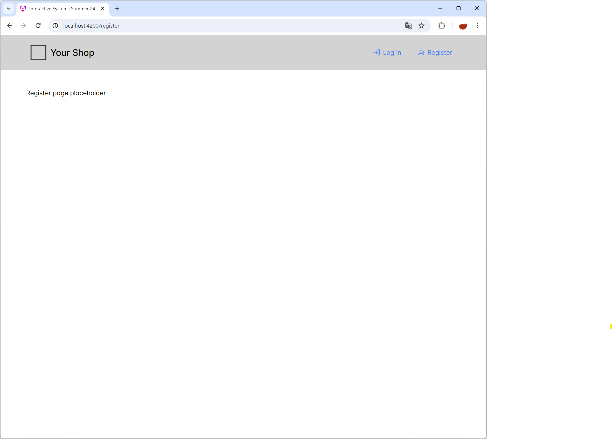

# Interactive Systems - Tutorial

## Assignment 1: Setup Development Environment

**Achieved Points: [__/10]**  
**Deadline: 23.04.2024 13:30**  

### Design Patterns

The following Design Patterns are applied in this assignment.

- [ ] [Layout](https://ebookcentral.proquest.com/lib/uni-konstanz/reader.action?docID=5996435&ppg=247) (Page 227)
- [ ] [Visual Framework](https://ebookcentral.proquest.com/lib/uni-konstanz/reader.action?docID=5996435&ppg=248) (Page 228)

You can find all design patterns in the book [Designing Interfaces: Patterns for Effective Interaction Design](https://ebookcentral.proquest.com/lib/uni-konstanz/detail.action?docID=5996435)

### Tasks

In this assignment, you will setup the development environment for the tutorial and familiarize yourself with the web framework Angular. 

- [ ] [Clone Git Repository](#clone-git-repository)
- [ ] [Setup Development Environment](#setup-development-environment)
- [ ] [Add Register Button (and Page) to the Header](#add-register-button-and-page-to-the-header) (10 Points)
- [ ] [Tag the Final Commit](#tag-the-final-commit)

### Instructions

#### Clone Git Repository

For the submission of the assignments is Git required. You can find a Git installation guide for all operating systems [here](https://git-scm.com/downloads). On MacOS, Git is automatically installed when Xcode is installed.

- Clone this Git repository to your computer.

#### Setup Development Environment

For front-end development with Angular, we need to install NodeJs, Angular, and a code editor of choice (we recommend Visual Studio Code).

- Install [NodeJS](https://nodejs.org/en) (LTS)
- Open the terminal and change the directory to the GIT repository folder (`cd <directory>`) 
- Install the Angular CLI (command-line interface) with the command  
  `npm install -g @angular/cli`
- Install all NodeJS packages of the project with the command  
  `npm install`
- Start the development server with the command  
  `npm run start`
- The web page should now be accessible through the following link: http://localhost:4200
- We recommend using [Visual Studio Code](https://code.visualstudio.com/) as code editor. For development, you just need to open the GIT repository folder in Visual Studio Code. While the development server is running, the web page updates automatically when you edit and save a file.
- When you are done with development, stop the development server by typing `CTRL + C` twice in the terminal.

> 💡 To start the development server again, open the terminal, change the directory to the GIT repository folder, and run the command `npm run start`

#### Add Register Button (and Page) to the Header

- Add a register button to the header (menubar).
  > 💡 The template uses PrimeIcons of PrimeNG. A list of all supported icons can be found [here](https://primeng.org/icons#list).
- When the register button is clicked, a register page should open below the header with the text "Register page placeholder". Also, the route in the web browser should change to http://localhost:4200/register
  > 💡 You can add new components to the project in the terminal with the command `ng generate component component-name`. Routes and their corresponding components can be defined in the `app.routes.ts` file.

#### Tag the Final Commit

- When you are finished with the assignment, tag the final commit before the deadline with the tag `assignment1`.

> 💡 You can tag a commit in the terminal with the command `git tag -a assignment1` or in GitLab (Code -> Tags -> New tag).
