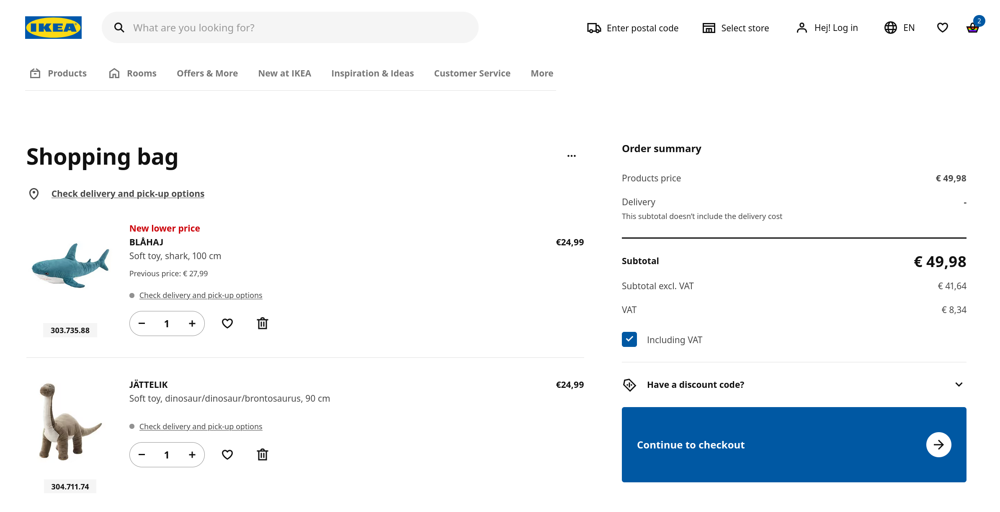

# Interactive Systems - Tutorial

## Assignment 7: Shopping Cart

**Achieved Points: [__/10]**  
**Deadline: 11.06.2024 13:30**

### Design Patterns

The following Design Patterns (or guidelines) are applied in this assignment:

- [ ] [Visual Hierarchy](https://ebookcentral.proquest.com/lib/uni-konstanz/reader.action?docID=5996435&ppg=229) (Page 209)
- [ ] [Cards](https://ebookcentral.proquest.com/lib/uni-konstanz/reader.action?docID=5996435&ppg=373) (Page 353)

You can find all design patterns in the book [Designing Interfaces: Patterns for Effective Interaction Design](https://ebookcentral.proquest.com/lib/uni-konstanz/detail.action?docID=5996435)

### Tasks

In this assignment, you will implement a shopping cart.

- [ ] [Implement 'Add to cart' button](#implement-add-to-cart-button) (2 Points)
- [ ] [Design cart page](#design-cart-page) (6 Points)
- [ ] [Implement Cart Badge](#implement-cart-badge) (2 Points)
- [ ] [Tag the Final Commit](#tag-the-final-commit)

### Instructions

#### Implement 'Add to cart' Button
2 Points

- Add a button to the product page that allows the user to add this product to the shopping cart. The button should have a label and icon to communicate its function to the user. Ensure that it is not possible to add a product to the cart that does not have a valid size and color selected.

- Ensure that the contents of the shopping cart are retained across page reloads.

  > 💡 The new `CartService` (in `cart.service.ts`) contains methods that use the browser's local storage to store data across page reloads (and sessions). To learn more about the `CartService` and local storage, see the tutorial slides and [MDN Web Docs](https://developer.mozilla.org/en-US/docs/Web/API/Window/localStorage).

  > 💡 The contents of the local storage can be checked in the web developer tools (sometimes called differently) of all common browsers.

#### Design Cart Page
6 Points

- Add a shopping cart page (e.g., accessible at the route <http://localhost:4200/cart>).

- Add a cart button to the page header. When the cart button is clicked the shopping cart page should open.

- On the cart page, add a list of items currently in the cart. Choose a suitable subset of product details to show in this list. The product image (of the correct color variant) must be included for each item. Clicking on a product in the cart should lead to this product's page.

  > 💡 When choosing details to show: Think about what information about the product the user might want to review at this point in their purchase.

  > 💡 The new `CartService` (in `cart.service.ts`) contains methods that use the browser's local storage to store data across page reloads (and sessions).

- For your design, apply the design patterns [Visual Hierarchy](https://ebookcentral.proquest.com/lib/uni-konstanz/reader.action?docID=5996435&ppg=229) and [Cards](https://ebookcentral.proquest.com/lib/uni-konstanz/reader.action?docID=5996435&ppg=373).

- When no items are in the cart, show a suitable message.

- The user should be able to change the quantity of each product in the shopping cart. Choose a suitable control to change the quantity. When the quantity of a product is set to 0, the product should be removed from the cart. Add also a button to directly remove a product from the cart.

- Display the total price of all items (including quantities) added together. This price should update as the quantity of a product is changed.

  > 💡 You are free to add additional prices (e.g. shipping or processing fees).

- Add a checkout button that will later lead the user to the checkout process. You will implement the full checkout process in a future assignment. Integrate this button into the [Visual Hierarchy](https://ebookcentral.proquest.com/lib/uni-konstanz/reader.action?docID=5996435&ppg=229) as the most prominent element.

#### Implement Cart Badge
2 Points

- Add a badge to the cart button in the header to indicate the number of products currently in the cart. If the cart is empty, the badge should not be shown. The badge should update as products are added or removed from the shopping cart.

  

  > 💡 You can use the PrimeNG [Badge](https://primeng.org/badge) component or the built-in [badge attribute](https://primeng.org/badge#button) of the [Button](https://primeng.org/button) component for this task. Setting the `badge` button attribute to an empty string or `undefined` hides the badge.

#### Tag the Final Commit

- When you are finished with the assignment, tag the final commit before the deadline with the tag `assignment7`.

> 💡 You can tag a commit in the terminal with the command `git tag -a assignment7` or in GitLab (Code -> Tags -> New tag). To push all tags to GitLab use the command `git push --tags`.

