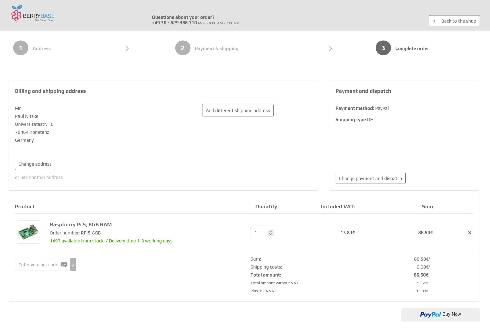

# Interactive Systems - Tutorial

## Assignment 8: Checkout Wizard

**Achieved Points: [__/20]**  
**Deadline: 25.06.2024 13:30**

### Design Patterns

The following Design Patterns (or guidelines) are applied in this assignment:

- [ ] [Wizard](https://ebookcentral.proquest.com/lib/uni-konstanz/reader.action?docID=5996435&ppg=106) (Page 86)
- [ ] [Progressive Disclosure](https://ebookcentral.proquest.com/lib/uni-konstanz/reader.action?docID=5996435&ppg=244) (Page 224)
- [ ] [Visual Hierarchy](https://ebookcentral.proquest.com/lib/uni-konstanz/reader.action?docID=5996435&ppg=229) (Page 209)
- [ ] [Structured Format](https://ebookcentral.proquest.com/lib/uni-konstanz/reader.action?docID=5996435&ppg=502) (Page 482)
- [ ] [Input Hints](https://ebookcentral.proquest.com/lib/uni-konstanz/reader.action?docID=5996435&ppg=509) (Page 489)
- [ ] [Input Prompt](https://ebookcentral.proquest.com/lib/uni-konstanz/reader.action?docID=5996435&ppg=514) (Page 494)

You can find all design patterns in the book [Designing Interfaces: Patterns for Effective Interaction Design](https://ebookcentral.proquest.com/lib/uni-konstanz/detail.action?docID=5996435)

### Tasks

In this assignment, you will implement a checkout wizard for your shop.

- [ ] [Design Wizard Structure](#design-wizard-structure) (6 Points)
- [ ] [Implement 'Address' Step](#implement-address-step) (4 Points)
- [ ] [Implement 'Delivery & Payment' Step](#implement-delivery--payment-step) (4 Points)
- [ ] [Implement 'Summary' Step](#implement-summary-step) (4 Points)
- [ ] [Implement Success Page](#implement-success-page) (2 Point)
- [ ] [Tag the Final Commit](#tag-the-final-commit)

### Instructions

#### Design Wizard Structure
6 Points

- Create a new page for the checkout wizard. It should open when the checkout button on the cart page is pressed

- Design a wizard interface for a multi-step checkout process with three steps: **Address, Delivery & Payment,** and **Summary** 

- The user should see at all times which step they are currently in and which other steps must be performed. For your design, apply the design pattern [Wizard](https://ebookcentral.proquest.com/lib/uni-konstanz/reader.action?docID=5996435&ppg=106).

  > 💡 You can use the PrimeNG [Stepper](https://primeng.org/stepper) component in your checkout wizard. Depending on your Angular version you may need to update the primeng npm package with `npm update primeng --save`.

- Apply the pattern [Progressive Disclosure](https://ebookcentral.proquest.com/lib/uni-konstanz/reader.action?docID=5996435&ppg=244) to guide the user through the steps. Make sure that the steps must be completed in chronological order. Ensure that the contents of next and past steps are hidden in the current step.

- When implementing the respective steps, ensure that the user cannot progress the wizard if the state of the current step is unclear (e.g. if a form is incomplete or otherwise invalid).

- Apply a [Visual Hierarchy](https://ebookcentral.proquest.com/lib/uni-konstanz/reader.action?docID=5996435&ppg=229) for the wizard and all its steps.

#### Implement 'Address' Step
4 Points

- In the first step of the checkout wizard, the user should enter the delivery address.

- Provide a pre-filled address to simulate the saved address of a logged-in user.

  > 💡 You can hard-code an address of your choice for this.

- Allow the user to change the provided address. Ensure that the user cannot progress this step in the wizard until a valid address is entered. A valid address consists of a name, street name + number, postal code, city and country.

- For the input of the custom address apply the patterns of [Assignment 2](assignment2.md): Apply [Structured Format](https://ebookcentral.proquest.com/lib/uni-konstanz/reader.action?docID=5996435&ppg=502), [Input Hints](https://ebookcentral.proquest.com/lib/uni-konstanz/reader.action?docID=5996435&ppg=509), [Input Prompt](https://ebookcentral.proquest.com/lib/uni-konstanz/reader.action?docID=5996435&ppg=514) where appropriate.

> 💡 You can use PrimeNG components as you see fit.

#### Implement 'Delivery & Payment' Step
3 Points

- In the second step of the checkout wizard, the user should select their preferred delivery option and payment method.

- Provide at least three shipping options. Each shipping option should have a delivery time and price associated.

- Provide at least three payment options.

- For both shipping and payment options, choose suitable icons.

  > 💡 You can use [PrimeIcons](https://primeng.org/icons#list) to find icons.

- The user should only be able to select one payment option and one delivery option. It should not be possible to progress without selecting an option.

#### Implement 'Summary' Step
2 Points

- In the last step of the checkout wizard, the user can review the checkout details before making a purchase.

- This step should show the delivery address, selected delivery and payment method, and total price.

- This step should contain a button that confirms the purchase. Upon pressing the button, the cart should be cleared.

#### Implement Success Page
2 Points

- Design a page that the user is redirected to after completing the checkout wizard. This page should not be part of the wizard.

- The page should inform the user that the checkout is successfully completed.

- The page should contain a button to direct the user to the start page.

<!-- #### Implement 'Add to cart' Button
2 Points

- Add a button to the product page that allows the user to add this product to the shopping cart. The button should have a label and icon to communicate its function to the user. Ensure that it is not possible to add a product to the cart that does not have a valid size and color selected.

- Ensure that the contents of the shopping cart are retained across page reloads.

  > 💡 The new `CartService` (in `cart.service.ts`) contains methods that use the browser's local storage to store data across page reloads (and sessions). To learn more about the `CartService` and local storage, see the tutorial slides and [MDN Web Docs](https://developer.mozilla.org/en-US/docs/Web/API/Window/localStorage).

  > 💡 The contents of the local storage can be checked in the web developer tools (sometimes called differently) of all common browsers.

#### Design Cart Page
6 Points

- Add a shopping cart page (e.g., accessible at the route <http://localhost:4200/cart>).

- Add a cart button to the page header. When the cart button is clicked the shopping cart page should open.

- On the cart page, add a list of items currently in the cart. Choose a suitable subset of product details to show in this list. The product image (of the correct color variant) must be included for each item. Clicking on a product in the cart should lead to this product's page.

  > 💡 When choosing details to show: Think about what information about the product the user might want to review at this point in their purchase.

  > 💡 The new `CartService` (in `cart.service.ts`) contains methods that use the browser's local storage to store data across page reloads (and sessions).

- For your design, apply the design patterns [Visual Hierarchy](https://ebookcentral.proquest.com/lib/uni-konstanz/reader.action?docID=5996435&ppg=229) and [Cards](https://ebookcentral.proquest.com/lib/uni-konstanz/reader.action?docID=5996435&ppg=373).

- When no items are in the cart, show a suitable message.

- The user should be able to change the quantity of each product in the shopping cart. Choose a suitable control to change the quantity. When the quantity of a product is set to 0, the product should be removed from the cart. Add also a button to directly remove a product from the cart.

- Display the total price of all items (including quantities) added together. This price should update as the quantity of a product is changed.

  > 💡 You are free to add additional prices (e.g. shipping or processing fees).

- Add a checkout button that will later lead the user to the checkout process. You will implement the full checkout process in a future assignment. Integrate this button into the [Visual Hierarchy](https://ebookcentral.proquest.com/lib/uni-konstanz/reader.action?docID=5996435&ppg=229) as the most prominent element.

#### Implement Cart Badge
2 Points

- Add a badge to the cart button in the header to indicate the number of products currently in the cart. If the cart is empty, the badge should not be shown. The badge should update as products are added or removed from the shopping cart.

  

  > 💡 You can use the PrimeNG [Badge](https://primeng.org/badge) component or the built-in [badge attribute](https://primeng.org/badge#button) of the [Button](https://primeng.org/button) component for this task. Setting the `badge` button attribute to an empty string or `undefined` hides the badge. -->

#### Tag the Final Commit

- When you are finished with the assignment, tag the final commit before the deadline with the tag `assignment8`.

> 💡 You can tag a commit in the terminal with the command `git tag -a assignment8` or in GitLab (Code -> Tags -> New tag). To push all tags to GitLab use the command `git push --tags`.

