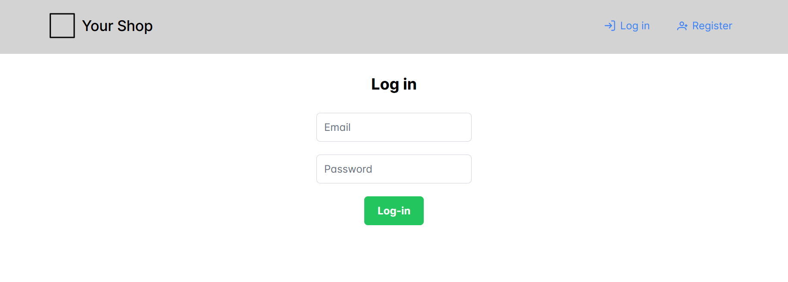
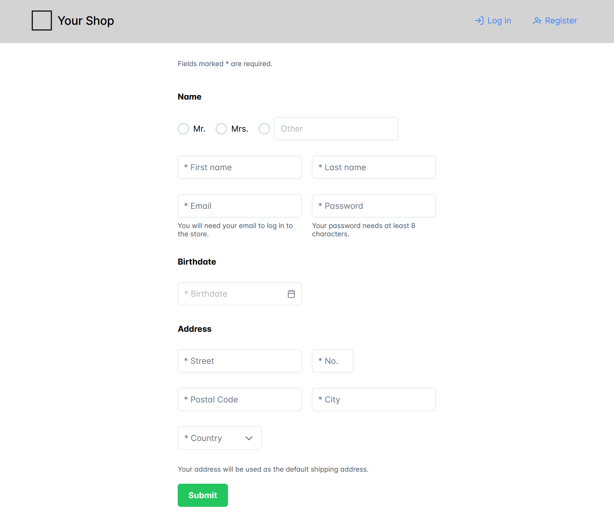

# Interactive Systems - Tutorial

## Assignment 2: Log In and Registration Form

**Achieved Points: [8/10]** ✅  
**Deadline: 30.04.2024 13:30**  

Log In Form:

Register Form:

### Design Patterns

The following Design Patterns are applied in this assignment.

- [ ] [Structured Format](https://ebookcentral.proquest.com/lib/uni-konstanz/reader.action?docID=5996435&ppg=502) (Page 482)
- [ ] [Input Hints](https://ebookcentral.proquest.com/lib/uni-konstanz/reader.action?docID=5996435&ppg=509) (Page 489)
- [ ] [Input Prompt](https://ebookcentral.proquest.com/lib/uni-konstanz/reader.action?docID=5996435&ppg=514) (Page 494)

You can find all design patterns in the book [Designing Interfaces: Patterns for Effective Interaction Design](https://ebookcentral.proquest.com/lib/uni-konstanz/detail.action?docID=5996435)

### Tasks

In this assignment, you will design and implement the forms for the Log In and Registration page. 

- [ ] [Implement Log In Form](#implement-log-in-form) (3/3 Points)
- [ ] [Implement Register Form](#implement-register-form) (4/4 Points)
- [ ] [Add Input Hints to Register Form](#add-input-hints-to-register-form) (0/1 Points)

  > ⚠️ Input hints should remain visible when an error message occurs.
- [ ] [Add Input Validation to Log In and Register Form](#add-input-validation-to-log-in-and-register-form) (1/2 Points)

  > ⚠️ No error messages appears when No. or Postal Code fields contains only non-number input (e.g. `a`).
- [ ] [Tag the Final Commit](#tag-the-final-commit)

### Instructions

#### Implement Log In Form

- Implement the Log In form in the Login component. The Log In form should provide the following input fields:
    - E-mail address
    - Password
- The input fields should have labels
- Below the input fields add a "Log In" button
- Apply the design patterns [Structured Format](https://ebookcentral.proquest.com/lib/uni-konstanz/reader.action?docID=5996435&ppg=502) and [Input Prompt](https://ebookcentral.proquest.com/lib/uni-konstanz/reader.action?docID=5996435&ppg=514)

> 💡 Remember: You can use PrimeNG components to implement the user interface. See the form components of PrimeNG (e.g., [FloatLabel](https://primeng.org/floatlabel)).

#### Implement Register Form

- Implement the Register form in the Register component (you added in the last assignment). The Register form should provide the following input fields:
    - Gender or salutation (Mr., Mrs., ...) (Radio Buttons)
    - First name
    - Last name
    - E-mail address
    - Password
    - Date of birth (optional: Use [Calendar](https://primeng.org/calendar) input)
    - Street
    - Street number
    - Postal code
    - City
    - Country (Dropdown, at least 3 options)
- The input fields should have labels
- Below the input fields add a "Submit" button
- Apply the design patterns [Structured Format](https://ebookcentral.proquest.com/lib/uni-konstanz/reader.action?docID=5996435&ppg=502) and [Input Prompt](https://ebookcentral.proquest.com/lib/uni-konstanz/reader.action?docID=5996435&ppg=514)

#### Add Input Hints to Register Form

- Apply the design pattern [Input Hints](https://ebookcentral.proquest.com/lib/uni-konstanz/reader.action?docID=5996435&ppg=509) to at least **2 input fields** of the register form

#### Add Input Validation to Log In and Register Form

- Give the user feedback (provide error message) when the input of a field is not correct
- The error messages should appear near the affected input fields
- The error messages should be highlighted by color (e.g., red)
- The input fields should be validated as follows:
    - First name: Not empty
    - Last name: Not empty
    - E-mail address: E-Mail format
    - Password: Minimum length 8 characters
    - Date of birth: Valid date format (Hint: Use [Calendar](https://primeng.org/calendar) input)
    - Street: Not empty
    - Street number: Number
      > 💡 For number validation you can use the pattern `/\d+/`. The pattern can be added to the Angular form as validator using `Validators.pattern(/\d+/)`
    - Postal code: Number
    - City: Not empty
    - Country: Selected an option

#### Tag the Final Commit

- When you are finished with the assignment, tag the final commit before the deadline with the tag `assignment2`.

> 💡 You can tag a commit in the terminal with the command `git tag -a assignment2` or in GitLab (Code -> Tags -> New tag). To push all tags to GitLab use the command `git push --tags`.
