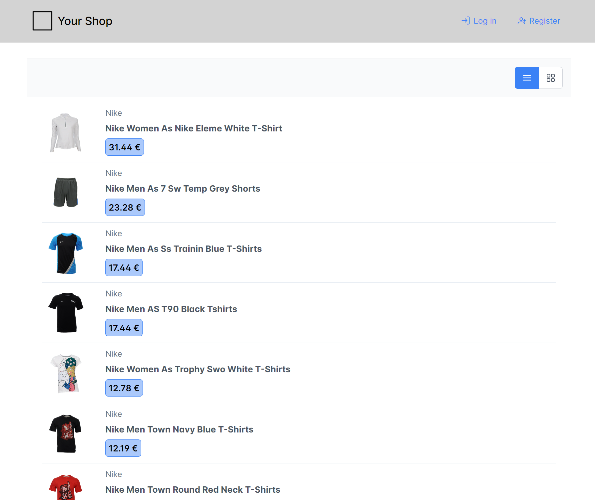
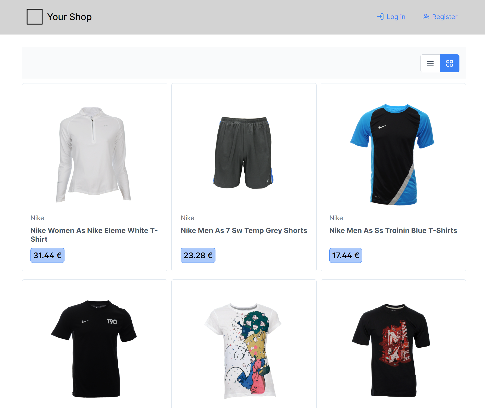

# Interactive Systems - Tutorial

## Assignment 3: Product List

**Achieved Points: [10/10]** ✅  
**Deadline: 07.05.2024 13:30**  

Product List:

Grid:

### Design Patterns

The following Design Patterns are applied in this assignment.

- [ ] [Cards](https://ebookcentral.proquest.com/lib/uni-konstanz/reader.action?docID=5996435&ppg=373) (Page 353)
- [ ] [Grid of Equals](https://ebookcentral.proquest.com/lib/uni-konstanz/reader.action?docID=5996435&ppg=255) (Page 235)

You can find all design patterns in the book [Designing Interfaces: Patterns for Effective Interaction Design](https://ebookcentral.proquest.com/lib/uni-konstanz/detail.action?docID=5996435)

### Tasks

In this assignment, you will load a dataset of products (locally) and display it as a list of items. You also allow the user to view the list in an alternative view (grid).

- [ ] [Implement Product List](#implement-product-list) (3/3 Points)
- [ ] [Design and Implement Product Item](#design-and-implement-product-item) (5/5 Points)
- [ ] [Add Alternative View (Grid)](#add-alternative-view-grid) (2/2 Points)
- [ ] [Tag the Final Commit](#tag-the-final-commit)

### Instructions

#### Implement Product List

- Create a new component for the product list.
- Modify the routes (`app.routes.ts`) to load the product list component on the start page.
  > 💡 You can link the component to an empty route `path: ''`.
- Add a constructor to the product list component that adds the `ProductService` (already part of the template).
- Create a `products` variable in the product list component that stores the products. 
  > 💡 You can initialize the variable with an empty array or mark it with `!` to prevent errors related to the variable not being initialized. 
- Load the products inside the constructor using the `getAllProductMetadata()` method of the `ProductService` and assign them to the `products` variable.
  > 💡 The `getAllProductMetadata()` method returns an Observable. Therefore you have to subscribe to the method: `getAllProductMetadata().subscribe((products: Product[]) => { });`
- List all names of the products in the product list component using `*ngFor`.

#### Design and Implement Product Item

- Create a new component for the product item.
- Add the variable `product` to the component and mark it with `@Input()` to allow the variable to be assigned from the parent component (product list component).
  > 💡 Mark the variable with `!` to prevent errors related to the variable not being initialized.
- List all products in the product list component using `*ngFor` and the new created product item component. Assign the `product` variable of the product item component by adding `[product]=...` to the HTML definiton. For example: `<app-product-item [product]="product"></app-product-item>`
- Design and implement the product item component. The item should contain at least the following metadata about a product:
  - Name
  - Brand
  - Price
  - Image
  > 💡 The image name corresponds to the product id. Therefore, you can use `` to load the image of the product.
- For your design, apply the design pattern [Cards](https://ebookcentral.proquest.com/lib/uni-konstanz/reader.action?docID=5996435&ppg=373)

#### Add Alternative View (Grid)

- Add two buttons at the top of the product list component to switch between list and grid view.
- Design and implement a product item grid component.
- Allow the user to view the products as a list or as grid by toggling the list or grid button at the top.
  > 💡 Remember: With `*ngIf` you can control the visibility of HTML elements
- For your design, apply the design pattern [Grid of Equals](https://ebookcentral.proquest.com/lib/uni-konstanz/reader.action?docID=5996435&ppg=255)

> 💡 Remember: You can use PrimeNG components to implement the user interface. See the [DataView](https://primeng.org/dataview) of PrimeNG.

#### Tag the Final Commit

- When you are finished with the assignment, tag the final commit before the deadline with the tag `assignment3`.

> 💡 You can tag a commit in the terminal with the command `git tag -a assignment3` or in GitLab (Code -> Tags -> New tag). To push all tags to GitLab use the command `git push --tags`.
