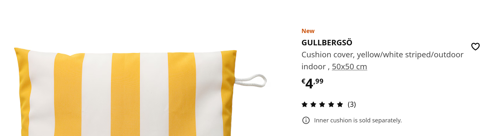

# Interactive Systems - Tutorial

## Assignment 5: Product Page

**Achieved Points: [10/10]** ✅ 
**Deadline: 21.05.2024 13:30**

### Design Patterns

The following Design Patterns (or guidelines) are applied in this assignment:

- [ ] [Visual Hierarchy](https://ebookcentral.proquest.com/lib/uni-konstanz/reader.action?docID=5996435&ppg=229) (Page 209)
- [ ] [Hover Tools](https://ebookcentral.proquest.com/lib/uni-konstanz/reader.action?docID=5996435&ppg=407) (Page 387)

You can find all design patterns in the book [Designing Interfaces: Patterns for Effective Interaction Design](https://ebookcentral.proquest.com/lib/uni-konstanz/detail.action?docID=5996435)

### Tasks

In this assignment, you will implement a product details page for the products in our shop.

- [ ] [Create Product Page and Add Routing](#create-product-page-and-add-routing) (3/3 Points)
- [ ] [Design Product Page with a Clear Visual Hierarchy](#design-product-page-with-a-clear-visual-hierarchy) (4/4 Points)
- [ ] [Implement Color Selection](#implement-color-selection) (2/2 Points)
- [ ] [Implement Hover Tools](#implement-hover-tools) (1/1 Point)
- [ ] [Tag the Final Commit](#tag-the-final-commit)

> 🏅 Very nice visual feedback when hovering over an entry in the product list/grid. Crosses as selection indicators might be confusing to the user as they could also signal unavailability of the color variant.

### Instructions

#### Create Product Page and Add Routing
3 Points

- Create a component for a product page that will (later) display the details of a product.
- Add routing to the page so that when the user clicks on a product in the list/grid view, the product page for that product is displayed.
> 💡 Carefully decide which element (in the grid/list view of each product) serves as a link to the product page.

> 💡 [This article](https://www.samjulien.com/how-to-use-route-parameters-in-angular) provides a nice explanation of using route parameters in Angular. Hint: In our tutorial we use `params` instead of `paramsMap` (but you are free to choose).

> 💡 You can define a route for the product page with the parameter `id` by adding the following to your your `app.routes.ts`:
> ```
> {
>    path: 'products/:id',
>    component: ProductDetailComponent
> },
>```

> 💡 You can make an element navigate to a route with `[routerLink]`. You can pass route parameters with `[routerLink]="['/products', product.id]"`. Then in your product page component you can read parameters from the route using `this.route.snapshot.params['id']` when `ActivatedRoute` is imported in the constructor (`constructor(private route: ActivatedRoute, …)`). Alternatively, you can subscribe to the parameters of the route with `this.route.params.subscribe((params: Params) => {…})`. See the tutorial slides and [this link](https://www.samjulien.com/how-to-use-route-parameters-in-angular) for an explanation of the differences between both methods.

#### Design Product Page with a Clear Visual Hierarchy
4 Points

- The product page needs to have at least the following elements:
  - Brand
  - Title
  - Picture
  - Price
  - Color variants (Element should exist as part of this task; implementation of the color selection is part of [Implement Color Selection](#implement-color-selection))
  - Size (dropdown)
  - Details (description)
- All details that are given in the product metadata object should be displayed. If you want to add more elements to make it more realistic, feel free to do so.
- The product page should also contain a short paragraph with a description of the product (see image as example). Since the product metadata contain no descriptions, you are free to invent or generate some text, or use blind text. It is ok to show the same text for every product.  
  
- Design the size and layout of the page elements in a way that provides a clear [Visual Hierarchy](https://ebookcentral.proquest.com/lib/uni-konstanz/reader.action?docID=5996435&ppg=229).
  > 💡 [This article](https://www.nngroup.com/articles/visual-hierarchy-ux-definition/) has also a good overview of how to achieve a good visual hierarchy.
  
  > 💡 Have a look at Gestalt Laws. 
- Find suitable design decisions especially for:
  - Font sizes
  - Order of elements
  - Distances between elements
  - Labels (Which elements might profit from a label?)

#### Implement Color Selection
2 Points

- If a product has several color variants, the user should be able to choose between them. When a color variant is chosen, the displayed product picture should be updated to the picture of that variant.
> 💡 Not all products have several color variants. The product with the id `10004` has several variants.

> 💡 You can use routing with query parameters to switch between color options:
> You can add `[queryParams]="{color: product.colors.at(0)?.color_id}` to the element in the list/grid view that routes to the product page (uses `[routerLink]`) to add the color as query parameter to the URL. Then in the product page you can read the query parameters like this:
> ```
> this.route.queryParams.subscribe((params) => {
>   if (params['color']) {
>       // do something
>   } else {
>       // do something else
>   }
> });
>```
> Alternatively, you can use `this.route.snapshot.queryParams['color’]`. See the tutorial slides and [this link](https://www.samjulien.com/how-to-use-route-parameters-in-angular) for an explanation of the differences between both methods.

#### Implement Hover Tools
1 Point

- When the user hovers over the picture, hover tools should become visible.
- For your design, apply the design pattern [Hover Tools](https://ebookcentral.proquest.com/lib/uni-konstanz/reader.action?docID=5996435&ppg=407)
> 💡You can use the [PrimeNG Image](https://primeng.org/image) `<p-image ...></p-image>` element with `[preview]="true"` as attribute to use the hover tools provided by PrimeNG.

#### Tag the Final Commit

- When you are finished with the assignment, tag the final commit before the deadline with the tag `assignment5`.

> 💡 You can tag a commit in the terminal with the command `git tag -a assignment5` or in GitLab (Code -> Tags -> New tag). To push all tags to GitLab use the command `git push --tags`.

