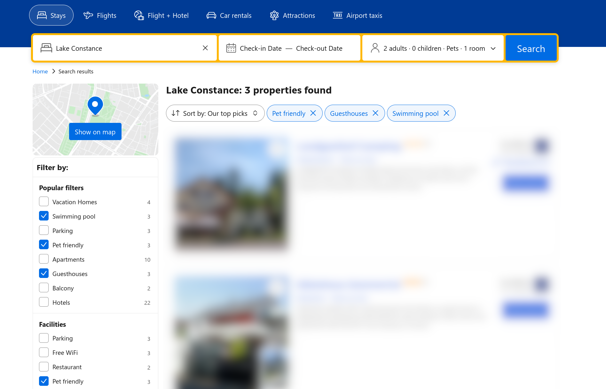

# Interactive Systems - Tutorial

## Assignment 6: Search and Filter

**Achieved Points: [10/10]** ✅ 
**Deadline: 04.06.2024 13:30**

### Design Patterns

The following Design Patterns (or guidelines) are applied in this assignment:

- [ ] [Feature, Search and Browse](https://ebookcentral.proquest.com/lib/uni-konstanz/reader.action?docID=5996435&ppg=59) (Page 39)
- [ ] [Dynamic Queries](https://ebookcentral.proquest.com/lib/uni-konstanz/reader.action?docID=5996435&ppg=475) (Page 455)

You can find all design patterns in the book [Designing Interfaces: Patterns for Effective Interaction Design](https://ebookcentral.proquest.com/lib/uni-konstanz/detail.action?docID=5996435)

### Tasks

In this assignment, you will implement search and filter bars for our shop.

- [ ] [Create Filter Sidebar](#create-filter-sidebar) (7/7 Points)
- [ ] [Create Search Bar](#create-search-bar) (3/3 Points)
- [ ] [Tag the Final Commit](#tag-the-final-commit)

### Instructions

#### Create Filter Sidebar
7 Points

- Create a filter sidebar component that contains filters for at least three attributes that are given in the product metadata (excluding `name` and `id`).
- The area containing the filters should be *to the side* of the list/grid view (not above).
- You can implement the filters to be activated via a checkbox. However, if you want, you can use more sophisticated solutions and look at input elements that might more closely match the filterable attributes.
  > 💡 The following PrimeNG components might be helpful: 
  >    - [Checkbox](https://primeng.org/checkbox)
  >    - [Multiselect](https://primeng.org/multiselect)
  >    - [Slider (with range)](https://primeng.org/slider#range)

- Your implementation should match the design pattern [Dynamic Queries](https://ebookcentral.proquest.com/lib/uni-konstanz/reader.action?docID=5996435&ppg=475): When a filter is activated/deactivated, the displayed products are updated instantly.
- Your implementation should match common expectations of how filters work: When selecting multiple filters from the same category, products matching any of the filters should be shown. When selecting multiple filters across categories, products matching all of the filters should be shown.

  > 💡 You can find information on how to use `getInitialProductMetadata` for filtering in the updated `product.service.ts` file and in the tutorial slides. 

- When the applied filters (and/or search) result in 0 products, show a message to the user why no products are shown. Chose a suitable place in the UI for this message. In this case, the "Load more products"-button should also not be shown.

#### Create Search Bar
3 Points

- Create a search bar above the product list. It should consist of an input field (to enter the search query) and a button (to start the search).
  > 💡 You can use the [PrimeNG Input Group Component](https://primeng.org/inputgroup#button) for this.

  > 💡 You could add the search bar next to the layout switch button.

- When the user has typed something in the search field, they should be able to start the search by either clicking a "search" button or pressing enter on the keyboard (your implementation has to support both). It should not start immediately, while the user types.

- Your implementation should match the "search" part of the design pattern [Feature, Search and Browse](https://ebookcentral.proquest.com/lib/uni-konstanz/reader.action?docID=5996435&ppg=59).

- When the applied search (and/or filters) result in 0 products, show a message to the user why there aren't any products shown. Chose a suitable place in the UI for this message. In this case, the "Load more products"-button should also not be shown.

> 💡 You can find information on how to use `getInitialProductMetadata` for searching in the updated `product.service.ts` file and in the tutorial slides. 

> 💡 The search function should search the product `name`. Specifically, if the search string is a substring of a product's `name` the product should be included in the search results.

> 💡 The search term and applied filters do _not_ need to be retained across site reloads.

#### Tag the Final Commit

- When you are finished with the assignment, tag the final commit before the deadline with the tag `assignment6`.

> 💡 You can tag a commit in the terminal with the command `git tag -a assignment6` or in GitLab (Code -> Tags -> New tag). To push all tags to GitLab use the command `git push --tags`.

